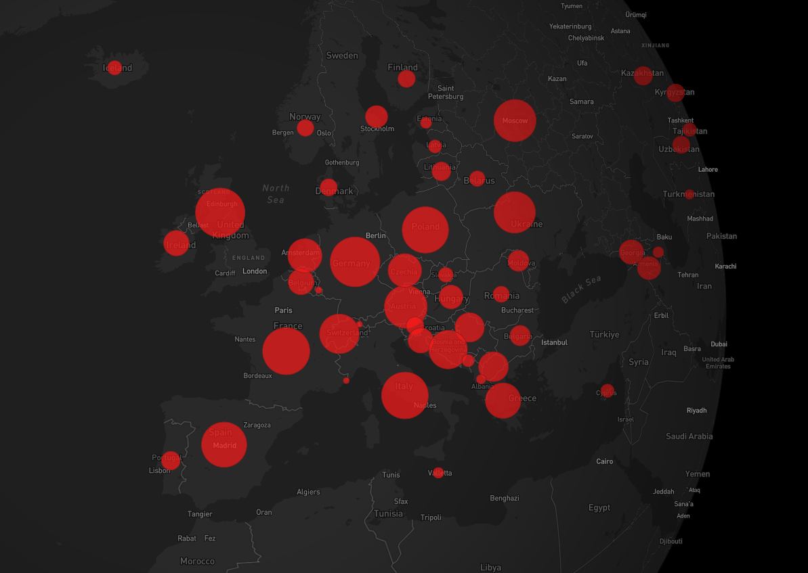
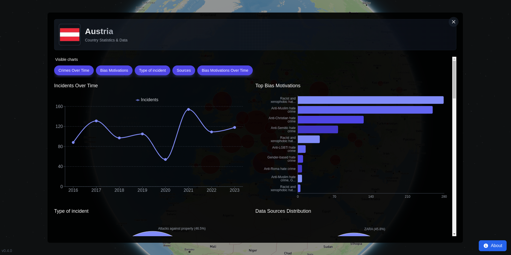

# Hate Crimes Map

[](https://github.com/kOaDT/hate-crimes-map/releases)
[](LICENSE)
[](https://github.com/kOaDT/hate-crimes-map)



A map visualizing hate crime data from around the world. The design is intentionally inspired by pandemic tracking dashboards (like the Johns Hopkins COVID-19 map) - dark background, red circles that grow with the number of incidents. Hate crimes spread through communities like a disease, and we wanted that parallel to be visible.

## Data

Data comes from the [ODIHR Hate Crime Reporting database](https://hatecrime.osce.org/hate-crime-data). If it's outdated, feel free to update it: convert the `.xlsx` to `.json` and drop it in `/public/data/hcrw_incidents_all-report.json`.

**Important**: This data only covers OSCE member states, and reporting varies wildly between countries. Many hate crimes go unreported. Take the numbers with a grain of salt.

This project is not affiliated with OSCE or ODIHR.

## Contributing

Contributions welcome. Update data, fix bugs, suggest features, or submit PRs. Check [CONTRIBUTING.md](CONTRIBUTING.md) for details.

Open source - use it however you want. See [LICENSE](LICENSE) for details.



## Setup

```bash
git clone https://github.com/kOaDT/hate-crimes-map.git
cd hate-crimes-map
npm install
```

Create `.env.local` and add your Mapbox token:

```
NEXT_PUBLIC_MAPBOX_TOKEN=your_token_here
```

Then:

```bash
npm run dev
```

---
